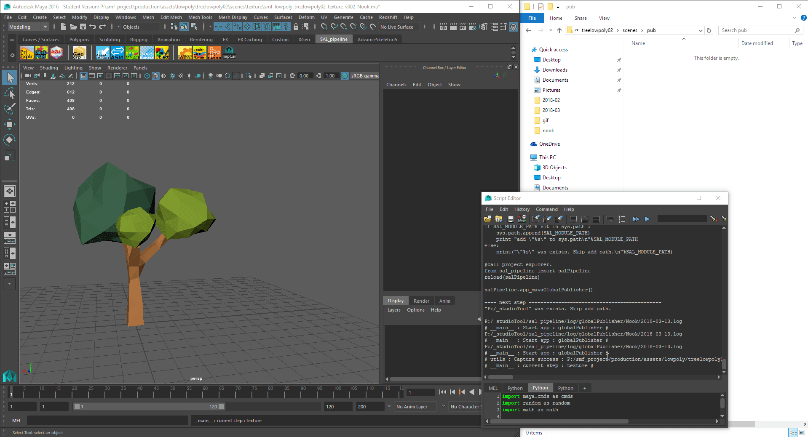

## sal_pipeline
VFX Pipeline toolset for Graduate project in 2017 : Visual effects, Digital art, Rangsit University

### to do [WIP] :
- [x] Project Explorer
- [x] Global preference editor
- [x] Asset importer
- [x] Global Publisher
- [ ] scene archive tool
- [ ] Connect pipeline to Project manager platform (Shotgun, TACTIC)

## Usage
1) Install this repository in your computer.
2) Copy prefs folder to ```Documents\maya\2016\prefs```
3) Open Maya then load sal_pipeline shelf.
4) Add `SAL_MODULE_PATH` to `Maya.env` 
```SAL_MODULE_PATH = Path:/To/sal_pipeline_repo```
7) Create you project folder.
6) Run `global_Preference_app.py` to setup your project setting.

## Configuration

#### Auto Setup
After deployment just run ```./global_Preference_app.py``` using any python interpreter and Add you project and team members.
    
#### Manual setup
rename file `./data/configure_default.json` to `./data/configure.json` and setup your project configuration.

I use computer name to mapped with username.

```JSON
{
	"setting": {
		"projects" : {
			"_Project_name_":{
				"project_path": "Path:/to/your/project_Directory",
				"project_code": "_project_code_",
				"project_name": "_project_fullname_",
				"active" : true
			}
		}
	},
	"username" :{
		"Computername1": "crew_name1",
		"Computername2": "crew_name2"
	}
}
```


## Overall Preview
#### Project Explorer


#### Global publish tool


#### Asset Importer tool


#### Maya Scene assembly controller


#### Render setting tool

